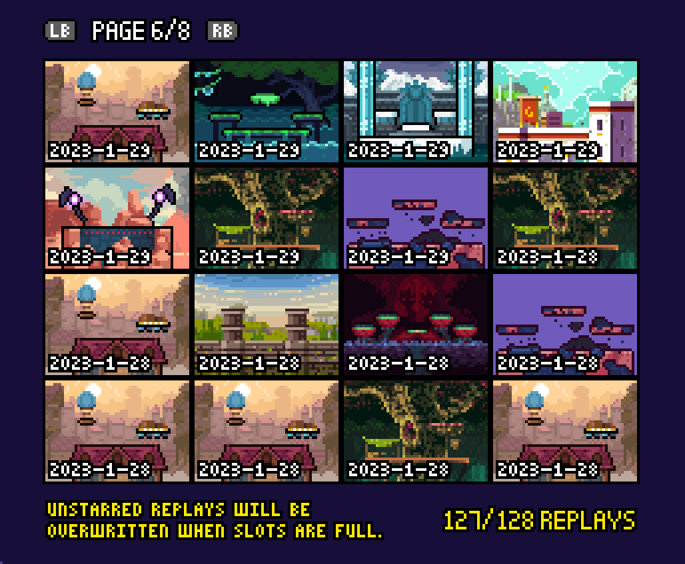
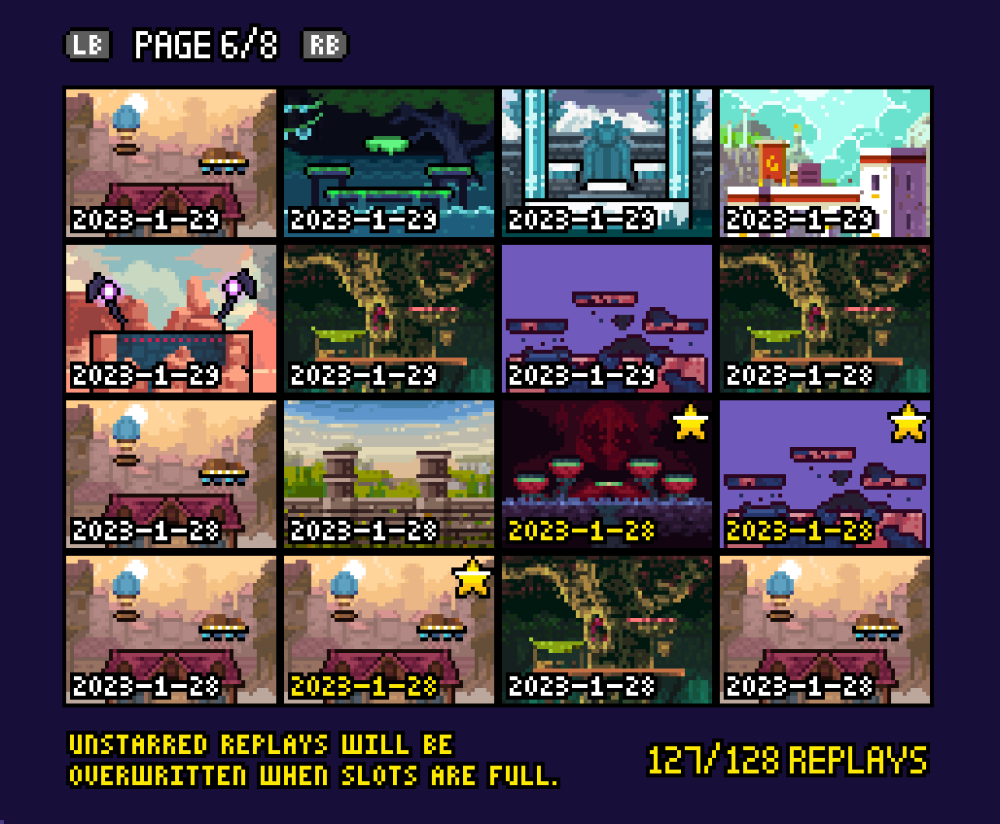

# Rivals of Aether Combo Finder

This script analyzes `.roa` replay files to find stocks that last under a certain interval and automatically "star" them in-game. This can be used for finding replays of quick 0 to death combos.

# Usage

Set `REPLAYS` to point to your rivals replay directory. Default is default steam install location.

Set `INTERVAL` to the amount of frames to include as a combo. Default is stocks under 15 seconds.

Set `ADD_STARS` to `True` to automatically star the replay so you can find it in game. Default is `True`.

```
python ./combo-finder.py
```

Before:




After:



3 replays on this page were found to have quick stocks!

# Known issues

* Self-Destructs are a common source of false-positives
* 0 to deaths that take too long to start may not be found
* If Forsburn's clone dies off the bottom, it is marked as a death and can cause false-positives

# Explanation

Line 9 of Rivals replays now include the frames that a character died on.

ex:

```
11455,10,1806,15,3277,10,7297,15,7887,10,11277,
```

The first entry is how any frames long the replay lasts. This can be discarded.

Next, what follows is a series of tuples (player_id, death_frame). Using this information we can simply determine how long a player was alive when they died. If this is under a certain interval, we know they were comboed and killed quickly.

Interpretation of line above:
```
Game lasts 11455 frames
Player1 died at 1806
Player2 died at 3277
Player1 died at 7297
Player2 died at 7887
Player1 died at 11277
```

# License

Distributed under the MIT License. See LICENSE.txt for more information.